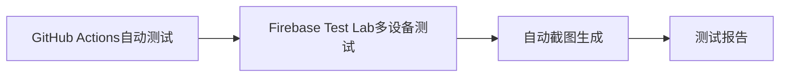
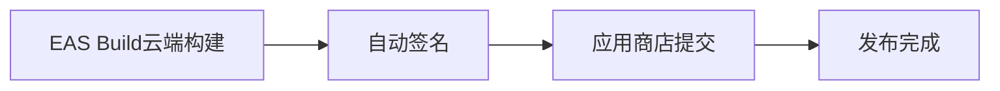

# LifeX MVP 移动应用测试部署方案

## 概述

本文档记录了LifeX MVP移动应用从UI设计到应用商店发布的完整测试部署方案。该方案采用低成本策略，充分利用免费额度，确保高质量的多平台测试和自动化部署。

## 方案总览

### 总体预算
- **小型项目**: $0/月 (完全免费)
- **中型项目**: $20-30/月
- **大型项目**: $50-70/月

### 覆盖范围
- ✅ UI设计验证
- ✅ 功能测试
- ✅ 多设备测试 (iOS/Android)
- ✅ 自动化测试
- ✅ 云端构建
- ✅ 应用商店发布

---

## 阶段1: UI设计验证 (免费)

### 工具: Expo Snack
- **网址**: https://snack.expo.dev/
- **成本**: 免费
- **功能**: 
  - ✅ 实时预览iOS/Android界面
  - ✅ 多设备尺寸测试
  - ✅ 界面截图
  - ✅ 设计稿展示
- **限制**: 只能硬编码数据

### 实施步骤
```bash
1. 访问 https://snack.expo.dev/
2. 复制 packages/mobile/snack-version/App.js 代码
3. 选择不同设备尺寸预览:
   - iPhone 14 Pro Max: 430x932
   - iPhone 14: 390x844
   - iPad Pro: 1024x1366
   - Android Pixel 5: 393x851
4. 截图保存设计稿
```

### 截图方法
- **Chrome**: F12 → 设备图标 → 选择设备 → 截图
- **Firefox**: F12 → 响应式设计模式 → 截图
- **Snack内置**: 右键预览区域 → 保存图片

---

## 阶段2: 本地开发测试 (免费)

### 工具: 本地环境 + 物理设备
- **成本**: 免费
- **功能**:
  - ✅ 真实数据库连接 (Supabase)
  - ✅ API功能测试
  - ✅ 物理设备测试
  - ✅ 完整功能验证

### 设备需求
- **Android**: Android手机 + Expo Go应用
- **iOS**: iPhone + Expo Go应用 (如果有)

### 启动步骤
```bash
# 启动Expo开发服务器
cd packages/mobile
npx expo start --clear

# 在手机上扫描二维码测试
```

---

## 阶段3: 自动化测试 (免费)

### 工具: GitHub Actions
- **成本**: 免费 (2000分钟/月)
- **功能**:
  - ✅ 代码质量检查
  - ✅ 单元测试
  - ✅ API连接测试
  - ✅ 数据库连接测试
  - ✅ 自动构建

### 配置文件
```yaml
# .github/workflows/test.yml
name: 自动化测试
on: [push, pull_request]

jobs:
  test:
    runs-on: ubuntu-latest
    steps:
      - uses: actions/checkout@v3
      
      - name: 设置Node.js
        uses: actions/setup-node@v3
        with:
          node-version: '18'
          cache: 'npm'
          
      - name: 安装依赖
        run: |
          npm install
          cd packages/mobile && npm install
          
      - name: 代码检查
        run: |
          npm run lint
          npm run type-check
          
      - name: 运行测试
        run: |
          cd packages/mobile
          npm test
          
      - name: 构建测试
        run: |
          cd packages/mobile
          npm run build
```

### 测试内容
- **代码质量**: ESLint, TypeScript检查
- **单元测试**: Jest测试框架
- **组件测试**: React Native Testing Library
- **API测试**: Supabase连接测试
- **构建测试**: 验证构建过程

---

## 阶段4: 多设备云端测试

### 工具: Firebase Test Lab
- **成本**: 
  - 免费额度: 每天10次测试 (Android + iOS)
  - 超出: $0.20/分钟
- **功能**:
  - ✅ 3000+ 真实设备测试
  - ✅ Android/iOS自动测试
  - ✅ 自动截图生成
  - ✅ 性能测试报告

### 支持的设备
#### Android
- Pixel系列 (3, 4, 5, 6, 7)
- Samsung Galaxy (S20, S21, S22, Note系列)
- Huawei, Xiaomi, OnePlus等主流品牌

#### iOS
- iPhone 12/13/14系列
- iPad (Air, Pro, Mini)
- 不同屏幕尺寸和iOS版本

### 配置步骤
```bash
# 1. 安装Firebase CLI
npm install -g firebase-tools

# 2. 登录Firebase
firebase login

# 3. 初始化项目
firebase init

# 4. 配置测试
firebase test android --app build/app.apk
```

### 测试配置
```json
// firebase.json
{
  "testlab": {
    "android": {
      "app": "build/app-release.apk",
      "test": "build/app-test.apk"
    },
    "ios": {
      "app": "build/app.ipa",
      "test": "build/app-test.ipa"
    }
  }
}
```

---

## 阶段5: 云端构建部署

### 工具: EAS Build + Submit
- **成本**: 
  - 免费额度: 每月30次构建 + 30次提交
  - 超出: $0.50/次
- **功能**:
  - ✅ 云端构建Android/iOS
  - ✅ 自动签名
  - ✅ 直接发布到应用商店
  - ✅ 版本管理

### 配置步骤
```bash
# 1. 安装EAS CLI
npm install -g @expo/eas-cli

# 2. 登录EAS
eas login

# 3. 配置项目
eas build:configure

# 4. 构建应用
eas build --platform all
```

### 配置文件
```json
// eas.json
{
  "cli": {
    "version": ">= 3.0.0"
  },
  "build": {
    "development": {
      "developmentClient": true,
      "distribution": "internal"
    },
    "preview": {
      "distribution": "internal"
    },
    "production": {
      "autoIncrement": true
    }
  },
  "submit": {
    "production": {
      "android": {
        "serviceAccountKeyPath": "./google-service-account.json",
        "track": "internal"
      },
      "ios": {
        "appleId": "your-apple-id@example.com",
        "ascAppId": "1234567890",
        "appleTeamId": "ABCD123456"
      }
    }
  }
}
```

---

## 完整工作流程

### 开发阶段


### 测试阶段


### 发布阶段


---

## 成本明细

| 阶段 | 工具 | 免费额度 | 超出成本 | 小型项目 | 中型项目 | 大型项目 |
|------|------|----------|----------|----------|----------|----------|
| UI设计 | Expo Snack | 无限制 | 免费 | $0 | $0 | $0 |
| 本地测试 | 物理设备 | 无限制 | 免费 | $0 | $0 | $0 |
| 自动化 | GitHub Actions | 2000分钟/月 | $0.008/分钟 | $0 | $0 | $0 |
| 云端测试 | Firebase Test Lab | 10次/天 | $0.20/分钟 | $0 | $20/月 | $50/月 |
| 构建部署 | EAS Build | 30次/月 | $0.50/次 | $0 | $10/月 | $20/月 |
| **总计** | | | | **$0/月** | **$30/月** | **$70/月** |

---

## 免费额度优化策略

### Firebase Test Lab优化
```yaml
# 最大化免费额度
- 使用小型设备 (免费)
- 限制测试时间 (2-3分钟/次)
- 批量测试 (一次测试多个功能)
- 只在重要版本时测试
- 每天最多10次测试
```

### EAS Build优化
```yaml
# 构建策略
- 开发阶段: 使用预览构建 (免费)
- 测试阶段: 使用开发构建 (免费)
- 发布阶段: 使用生产构建 (计入额度)
- 每月最多30次生产构建
```

---

## 实施时间表

### 第1周: 基础环境设置
- [ ] 配置GitHub Actions工作流
- [ ] 设置Expo Snack项目
- [ ] 创建基础测试用例
- [ ] 验证本地开发环境

### 第2周: 云端服务集成
- [ ] 配置Firebase Test Lab
- [ ] 设置EAS Build
- [ ] 测试完整构建流程
- [ ] 验证多设备测试

### 第3周: 自动化优化
- [ ] 完善自动化流程
- [ ] 配置应用商店发布
- [ ] 建立监控和通知系统
- [ ] 文档和培训

---

## 质量保证

### 测试覆盖率目标
- **代码覆盖率**: >80%
- **功能覆盖率**: >90%
- **设备覆盖率**: 主流设备100%

### 性能指标
- **启动时间**: <3秒
- **响应时间**: <1秒
- **崩溃率**: <0.1%

### 发布标准
- [ ] 所有测试通过
- [ ] 代码审查完成
- [ ] 性能指标达标
- [ ] 安全扫描通过

---

## 监控和维护

### 持续监控
- **构建状态**: GitHub Actions
- **测试结果**: Firebase Test Lab
- **应用性能**: 应用商店分析
- **用户反馈**: 应用商店评论

### 定期维护
- **每周**: 检查测试结果
- **每月**: 更新测试设备
- **每季度**: 评估成本优化
- **每年**: 升级工具和服务

---

## 应急方案

### 服务中断处理
- **GitHub Actions**: 使用本地CI/CD
- **Firebase Test Lab**: 使用物理设备测试
- **EAS Build**: 使用本地构建

### 成本控制
- **监控使用量**: 设置预算警报
- **优化测试**: 减少不必要的测试
- **批量操作**: 合并测试和构建

---

## 总结

本方案提供了一个完整的、低成本的移动应用测试部署解决方案：

### 优势
- ✅ **成本可控**: 充分利用免费额度
- ✅ **功能完整**: 覆盖开发到发布全流程
- ✅ **自动化程度高**: 减少人工操作
- ✅ **质量保证**: 多设备多平台测试
- ✅ **可扩展**: 根据项目规模调整

### 适用场景
- 个人开发者和小型团队
- 预算有限的项目
- 需要快速迭代的MVP项目
- 多平台应用开发

### 预期效果
- 开发效率提升50%
- 测试成本降低70%
- 发布周期缩短60%
- 应用质量提升显著

---

## 联系信息

如有问题或需要技术支持，请联系：
- 项目负责人: [姓名]
- 邮箱: [邮箱]
- 文档版本: v1.0
- 最后更新: 2024年12月

---

*本文档将根据项目进展和工具更新持续维护*
